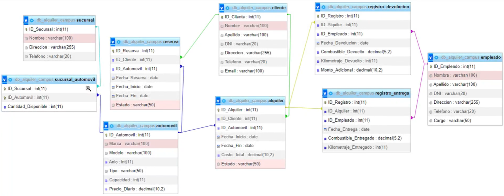

# ALQUILER CAMPUS DATABASE 


## MONGODB

Se crea una base de datos de alquiler para campus con MongoDB


##### DIAGRAMA 




## INSTALACIÓN

1. Para descargar Node.js ve a la siguiente página "[Download | Node.js (nodejs.org)](https://nodejs.org/en/download)".

2. Descarga la versión de Node.js correspondiente a su sistema operativo.

3. Clona este repositorio en tu máquina local.

   - https://github.com/JhonEduardAlmeidaHernandezCampus/DBMongoAlquiler.git

4. Abre una terminal en el editor de código de tu preferencia, se recomienda "Visual Studio Code".

5. Ejecuta el siguiente comando para instalar las dependencias:

   `NOTA:` Las dependencias a utilizar ya vienen dentro del proyecto, solo clone el repositorio y abra la terminal e ingrese el siguiente comando.

```
npm install;
```


## CONFIGURACIÓN

1. Asegurarse de tener creada la base de datos, si no cuentas con una base de datos, este proyecto ya trae una por defecto en la ruta `db/db.mongodb`
   - Ejecuta el script para crear la base de datos en Mongo.
2. Crea un archivo `.env` en el directorio raíz de la aplicación.
   - Define las siguientes variables de entorno:

```
MY_CONFIG = {"hostname": "", "port": }
MY_CONNECT = {"user": "", "password": "", "database": "db_campus_alquiler"}
JWT_KEY = ""
```

3. Una vez instaladas las dependencias y configurado las variables de entorno, tienes que ejecutar el nodemon de la siguiente manera.

```
npm run dev
```


**------------------------------**

## GENERAR TOKEN ACCESO

Antes de empezar a utilizar las diferentes rutas y endPoints debemos generar un token de acceso a la tabla a la que vamos a consultar, que debemos colocar en nuestro header/Autorization, este token tiene un limite de 30h, en ese rango de tiempo podremos acceder a las rutas y endPoints de nuestra API.

para generar nuestro token, debemos acceder a nuestra extensión de visual estudio llamada **Thunder-Client**, colocar la siguiente ruta:

`POST:` **http://"hostname":"port"/generarToken/cliente**	

**------------------------------**

**PDTA:** Se genera el token a la tabla a la que vaya a hacer las consultas o métodos como POST, PUT y DELETE 

```
Tablas: {
	alquiler,
	automovil,
	cliente,
	empleado,
	registro_devolucion,
	registro_entrega,
	reserva,
	sucursal_automovil,
	sucursal
}
```

**------------------------------**

```
El token generado se mostrara en la pantalla de resultado de `Thunder-Client`
```

Una vez obtenido nuestro token debemos ingresarlo en la extensión de visual estudio `Thunder-Client` ruta "Headers", una vez dentro, en la casilla de header colocar `Authorization`, y el token generado anteriormente.

- Tener en cuenta que el token solo funciona para esa tabla en especifico, si quiere hacer consultas o algún método de otra tabla, tendrá que generar un token de acceso a esa tabla y enviarlo por el `Header.`

**------------------------------**

**------------------------------**

## ENDPOINTS


**------------------------------------------------------------**

### ALQUILER

#### GET: `http://"hostname":"port"/alquiler`

Este EndPoint devuelve una lista de alquileres existentes.

```
[
    {
        _ID_Alquiler: 1,
        ID_Cliente_ID_Cliente: 1,
        ID_Automovil_ID_Automovil: 1,
        Fecha_Inicio: "2023-08-01",
        Fecha_Fin: "2023-08-12",
        Costo_Total: 1200000,
        Estado: "Activo"
    },
    {
        _ID_Alquiler: 2,
        ID_Cliente_ID_Cliente: 3,
        ID_Automovil_ID_Automovil: 2,
        Fecha_Inicio: "2023-07-20",
        Fecha_Fin: "2023-07-30",
        Costo_Total: 800000,
        Estado: "Finalizado"
    },
    ...
]
```


#### POST: `http://"hostname":"port"/alquiler`

Este EndPoint permite agregar un alquiler nuevo.

**Parámetros de entrada:**

- `ID` : ID del alquiler **"Number"**.
- `ID_Client`: ID del cliente **"Number"**.
- `ID_Car` : ID del automovil **"Number"**.
- `Date_Start`: Fecha inicio de alquiler **"String"**.
- `Date_End`: Fecha final de alquiler **"String"**.
- `Daily_Price`: Costo total del alquiler **"Number"**.
- `Status`: Estado del alquiler **"String"**.

**Ejemplo:**

```
{
    "ID": 1,
    "ID_Client": 1,
    "ID_Car": 1,
    "Date_Start":  "2023-08-12",
    "Date_End":  "2023-08-12",
    "Daily_Price": 100000,
    "Status": "Activo"
}
```

**`NOTA:`** Todos los campos están validados, tanto las llaves como los parámetros a enviar, si no pasa una llave o un dato como se muestra en este ejemplo, el programa le va a arrojar un error.


#### PUT: `http://"hostname":"port"/alquiler/:ID`

Este EndPoint permite actualizar los campos de la tabla de alquiler.

**Parámetros de entrada:**

- `ID` : ID del alquiler **"Number"**.
- `ID_Client`: ID del cliente **"Number"**.
- `ID_Car` : ID del automovil **"Number"**.
- `Date_Start`: Fecha inicio de alquiler **"String"**.
- `Date_End`: Fecha final de alquiler **"String"**.
- `Daily_Price`: Costo total del alquiler **"Number"**.
- `Status`: Estado del alquiler **"String"**.

**Ejemplo:**

```
{
    "ID": 1,
    "ID_Client": 1,
    "ID_Car": 1,
    "Date_Start": "2023-08-12",
    "Date_End": "2023-08-12",
    "Daily_Price": 100000,
    "Status": "Activo"
}
```

**`NOTA:`** Todos los campos están validados, tanto las llaves como los parámetros a enviar, si no pasa una llave o un dato como se muestra en este ejemplo, el programa le va a arrojar un error.

**`IMPORTANTE`** El campo ID se pasa por el header, el campo también esta validado de que sea solo numero, en tal caso de que le pase una letra el programa le va a botar un error.


#### DELETE: `http://"hostname":"port"/alquiler/:ID`

Este EndPoint permite eliminar el registro de la tabla de alquiler.

**Parámetros de entrada:**

- `ID` : ID del alquiler que va a eliminar **"Number"**.

**`IMPORTANTE`** El campo ID se pasa por el header, el campo también esta validado de que sea solo numero, en tal caso de que le pase una letra el programa le va a botar un error.


##### 6. Obtener los detalles del alquiler con el ID_Alquiler específico. 

`http://127.10.10.10:5500/alquiler/id/2 `

##### 9. Obtener el costo total de un alquiler específico. 

`http://127.10.10.10:5500/alquiler/costo_alquiler/4`

##### 12. Obtener los detalles del alquiler que tiene fecha de inicio en '2023-07-05'. 

`http://127.10.10.10:5500/alquiler/fecha_inicio/2023-07-05`

##### 18. Obtener la cantidad total de alquileres registrados en la base de datos.

``

##### 21. Listar los alquileres con fecha de inicio entre '2023-07-05' y '2023-07-10'.

`http://127.10.10.10:5500/alquiler/fecha_entre`

**------------------------------------------------------------**


**------------------------------------------------------------**

### AUTOMOVIL

#### GET: `http://"hostname":"port"/automovil`

Este EndPoint devuelve una lista de automóviles existentes.

```
[
    {
        _ID_Automovil: 1,
        Marca: "Renault",
        Modelo: "Logan",
        Anio: 2020,
        Tipo: "Automatico",
        Capacidad: 2,
        Precio_Diario: 520000
    },
    {
        _ID_Automovil: 2,
        Marca: "Chevrolet",
        Modelo: "Cruze",
        Anio: 2023,
        Tipo: "Mecanico",
        Capacidad: 5,
        Precio_Diario: 220000
    },
    ...
]
```


#### POST: `http://"hostname":"port"/automovil`

Este EndPoint permite agregar un automóvil nuevo.

**Parámetros de entrada:**

- `ID` : ID del automóvil **"Number"**.
- `Brand`: Marca del automóvil **"String"**.
- `Model` : Modelo del automóvil **"String"**.
- `Year`: Año de creación del automóvil **"Number"**.
- `Type`: Tipo "Automático - Manual" **"String"**.
- `Capacity`: Capacidad de personas **"Number"**.
- `Daily_Price`: Precio diario **"Number"**.

**Ejemplo:**

```
{
    "ID": 1,
    "Brand": "Chevrolet",
    "Model": "Spark",
    "Year": 2020,
    "Type": "Automatico",
    "Capacity": 5,
    "Daily_Price": 1000000
}
```

**`NOTA:`** Todos los campos están validados, tanto las llaves como los parámetros a enviar, si no pasa una llave o un dato como se muestra en este ejemplo, el programa le va a arrojar un error.


#### PUT: `http://"hostname":"port"/automovil/:ID`

Este EndPoint permite actualizar los campos de la tabla de automóvil.

**Parámetros de entrada:**

- `ID` : ID del automóvil **"Number"**.
- `Brand`: Marca del automóvil **"String"**.
- `Model` : Modelo del automóvil **"String"**.
- `Year`: Año de creación del automóvil **"Number"**.
- `Type`: Tipo "Automático - Manual" **"String"**.
- `Capacity`: Capacidad de personas **"Number"**.
- `Daily_Price`: Precio diario **"Number"**.

**Ejemplo:**

```
{
    "ID": 1,
    "Brand": "Chevrolet",
    "Model": "Spark",
    "Year": 2020,
    "Type": "Automatico",
    "Capacity": 5,
    "Daily_Price": 1000000
}
```

**`NOTA:`** Todos los campos están validados, tanto las llaves como los parámetros a enviar, si no pasa una llave o un dato como se muestra en este ejemplo, el programa le va a arrojar un error.

**`IMPORTANTE`** El campo ID se pasa por el header, el campo también esta validado de que sea solo numero, en tal caso de que le pase una letra el programa le va a botar un error.


#### DELETE: `http://"hostname":"port"/automovil/:ID`

Este EndPoint permite eliminar el registro de la tabla de automóvil.

**Parámetros de entrada:**

- `ID` : ID del automóvil que va a eliminar **"Number"**.

**`IMPORTANTE`** El campo ID se pasa por el header, el campo también esta validado de que sea solo numero, en tal caso de que le pase una letra el programa le va a botar un error.


##### 3. Obtener todos los automóviles disponibles para alquiler.

`http://127.10.10.10:5500/automovil/disponibles_alquiler `

##### 8. Mostrar la cantidad total de automóviles disponibles en cada sucursal.

`http://127.10.10.10:5500/automovil/cantidad_total`

##### 11. Mostrar todos los automóviles con una capacidad mayor a 5 personas.

`http://127.10.10.10:5500/automovil/capacidad`

##### 16. Listar todos los automóviles ordenados por marca y modelo. 

`http://127.10.10.10:5500/automovil/order`

##### 17. Mostrar la cantidad total de automóviles en cada sucursal junto con su dirección. 

`http://127.10.10.10:5500/automovil/cantidad_direccion`

##### 19.Mostrar los automóviles con capacidad igual a 5 personas y que estén disponibles.

`http://127.10.10.10:5500/automovil/capacidad_disponible`

**------------------------------------------------------------**


**------------------------------------------------------------**

### CLIENTE

#### GET: `http://"hostname":"port"/cliente`

Este EndPoint devuelve una lista de clientes existentes.

```
[
    {
        _ID_Cliente: 1,
        Nombre: "Jhon",
        Apellido: "Hernandez",
        DNI: "1102312327",
        Direccion: "Piedecuesta - Santander",
        Telefono: "3005559677",
        Email: "JhonHernandez.1899@gmail.com"
    },
    {
        _ID_Cliente: 2,
        Nombre: "Camilo",
        Apellido: "Sanchez",
        DNI: "1154254478",
        Direccion: "Chia - Bogota",
        Telefono: "3652255488",
        Email: "Camilo.Sanchez@gmail.com"
    },
    ...
]
```


#### POST: `http://"hostname":"port"/cliente`

Este EndPoint permite agregar un cliente nuevo.

**Parámetros de entrada:**

- `ID` : ID del cliente **"Number"**.
- `Name`: Nombre del cliente **"String"**.
- `Surname` : Apellido del cliente **"String"**.
- `Identification`: Identificación del cliente **"String"**.
- `Address`: Dirección del cliente **"String"**.
- `Phone`: Teléfono del cliente **"String"**.
- `Email`: Email del cliente **"String"**.

**Ejemplo:**

```
{
    "ID": 1,
    "Name": "Camilo",
    "Surname": "Sanchez",
    "Identification": "25544771",
    "Address": "Zapatoca - Santander",
    "Phone": "+57 3002447166",
    "Email": "camilo.Sanchez@gmail.com"
}
```

**`NOTA:`** Todos los campos están validados, tanto las llaves como los parámetros a enviar, si no pasa una llave o un dato como se muestra en este ejemplo, el programa le va a arrojar un error.


#### PUT: `http://"hostname":"port"/cliente/:ID`

Este EndPoint permite actualizar los campos de la tabla de cliente.

**Parámetros de entrada:**

- `ID` : ID del cliente **"Number"**.
- `Name`: Nombre del cliente **"String"**.
- `Surname` : Apellido del cliente **"String"**.
- `Identification`: Identificación del cliente **"String"**.
- `Address`: Dirección del cliente **"String"**.
- `Phone`: Teléfono del cliente **"String"**.
- `Email`: Email del cliente **"String"**.

**Ejemplo:**

```
{
    "ID": 1,
    "Name": "Camilo",
    "Surname": "Sanchez",
    "Identification": "25544771",
    "Address": "Zapatoca - Santander",
    "Phone": "+57 3002447166",
    "Email": "camilo.Sanchez@gmail.com"
}
```

**`NOTA:`** Todos los campos están validados, tanto las llaves como los parámetros a enviar, si no pasa una llave o un dato como se muestra en este ejemplo, el programa le va a arrojar un error.

**`IMPORTANTE`** El campo ID se pasa por el header, el campo también esta validado de que sea solo numero, en tal caso de que le pase una letra el programa le va a botar un error.


#### DELETE: `http://"hostname":"port"/cliente/:ID`

Este EndPoint permite eliminar el registro de la tabla de cliente.

**Parámetros de entrada:**

- `ID` : ID del cliente que va a eliminar **"Number"**.

**`IMPORTANTE`** El campo ID se pasa por el header, el campo también esta validado de que sea solo numero, en tal caso de que le pase una letra el programa le va a botar un error.


##### 2. Mostrar todos los clientes registrados en la base de datos. 

`http://127.10.10.10:5500/cliente/todos `

##### 4. Listar todos los alquileres activos junto con los datos de los clientes relacionados.

`http://127.10.10.10:5500/cliente/alquileres_activos`

##### 5. Mostrar todas las reservas pendientes con los datos del cliente y el automóvil reservado.

`http://127.10.10.10:5500/cliente/reservas_pendientes`

##### 10. Listar los clientes con el DNI específico. 

`http://127.10.10.10:5500/cliente/dni/1102312327`

##### 13. Listar las reservas pendientes realizadas por un cliente específico.

`http://127.10.10.10:5500/cliente/cliente_id/4`

##### 15. Obtener los datos de los clientes que realizaron al menos un alquiler. 

`http://127.10.10.10:5500/cliente/realizaron_alquiler`

##### 20. Obtener los datos del cliente que realizó la reserva con ID_Reserva específico

`http://127.10.10.10:5500/cliente/reserva_id/2`

**------------------------------------------------------------**


**------------------------------------------------------------**

### EMPLEADO

#### GET: `http://"hostname":"port"/empleado`

Este EndPoint devuelve una lista de empleados existentes.

```
[
    {
        _ID_Empleado: 1,
        Nombre: "María",
        Apellido: "Gomez",
        DNI: "876543210",
        Direccion: "Madrid - España",
        Telefono: "654321098",
        Cargo: "Vendedor"
    },
    {
        _ID_Empleado: 2,
        Nombre: "Juan",
        Apellido: "Lopez",
        DNI: "456789123",
        Direccion: "Buenos Aires - Argentina",
        Telefono: "789123456",
        Cargo: "Asistente"
    },
    ...
]
```


#### POST: `http://"hostname":"port"/empleado`

Este EndPoint permite agregar un empleado nuevo.

**Parámetros de entrada:**

- `ID` : ID del empleado **"Number"**.
- `Name`: Nombre del empleado **"String"**.
- `Surname` : Apellido del empleado **"String"**.
- `Identification`: Identificación del empleado **"String"**.
- `Address`: Dirección del empleado **"String"**.
- `Phone`: Teléfono del empleado **"String"**.
- `Position`: Cargo del empleado **"String"**.

**Ejemplo:**

```
{
    "ID": 1,
    "Name": "Camilo Andres",
    "Surname": "Quintero Sanchez",
    "Identification": "336524621",
    "Address": "Lebrija - Santander",
    "Phone": "+57 3225489677",
    "Position": "Gerente"
}
```

**`NOTA:`** Todos los campos están validados, tanto las llaves como los parámetros a enviar, si no pasa una llave o un dato como se muestra en este ejemplo, el programa le va a arrojar un error.


#### PUT: `http://"hostname":"port"/empleado/:ID`

Este EndPoint permite actualizar los campos de la tabla de empleado.

**Parámetros de entrada:**

- `ID` : ID del empleado **"Number"**.
- `Name`: Nombre del empleado **"String"**.
- `Surname` : Apellido del empleado **"String"**.
- `Identification`: Identificación del empleado **"String"**.
- `Address`: Dirección del empleado **"String"**.
- `Phone`: Teléfono del empleado **"String"**.
- `Position`: Cargo del empleado **"String"**.

**Ejemplo:**

```
{
    "ID": 1,
    "Name": "Camilo Andres",
    "Surname": "Quintero Sanchez",
    "Identification": "336524621",
    "Address": "Lebrija - Santander",
    "Phone": "+57 3225489677",
    "Position": "Gerente"
}
```

**`NOTA:`** Todos los campos están validados, tanto las llaves como los parámetros a enviar, si no pasa una llave o un dato como se muestra en este ejemplo, el programa le va a arrojar un error.

**`IMPORTANTE`** El campo ID se pasa por el header, el campo también esta validado de que sea solo numero, en tal caso de que le pase una letra el programa le va a botar un error.


#### DELETE: `http://"hostname":"port"/empleado/:ID`

Este EndPoint permite eliminar el registro de la tabla de cliente.

**Parámetros de entrada:**

- `ID` : ID del empleado que va a eliminar **"Number"**.

**`IMPORTANTE`** El campo ID se pasa por el header, el campo también esta validado de que sea solo numero, en tal caso de que le pase una letra el programa le va a botar un error.


##### 7. Listar los empleados con el cargo de "Vendedor". 

`http://127.10.10.10:5500/empleado/cargo/Vendedor `

##### 14. Mostrar los empleados con cargo de "Gerente" o "Asistente". 

`http://127.10.10.10:5500/empleado/multiple_cargo`

**------------------------------------------------------------**


**------------------------------------------------------------**

### REGISTRO DEVOLUCIÓN

#### GET: `http://"hostname":"port"/registro_devolucion`

Este EndPoint devuelve una lista de registro de devoluciones existentes.

```
[
    {
        ID_Registro: 1,
        ID_Alquiler_ID_Alquiler: 1,
        ID_Empleado_ID_Empleado: 1,
        Fecha_Devolucion: "2023-08-24",
        Combustible_Devuelto: "2 Galones",
        Kilometraje_Devuelto: 1200,
        Monto_Adicional: 1000
    },
    {
        ID_Registro: 2,
        ID_Alquiler_ID_Alquiler: 2,
        ID_Empleado_ID_Empleado: 2,
        Fecha_Devolucion: "2023-08-25",
        Combustible_Devuelto: "3 Galones",
        Kilometraje_Devuelto: 1500,
        Monto_Adicional: 50000
    },
    ...
]
```


#### POST: `http://"hostname":"port"/registro_devolucion`

Este EndPoint permite agregar un registro de devolución nuevo.

**Parámetros de entrada:**

- `ID` : ID del registro de devolución **"Number"**.
- `ID_Hire`: ID del alquiler **"Number"**.
- `ID_Employee` : ID del empleado **"Number"**.
- `Date_Return`: fecha de devolucion del auto **"String"**.
- `Fuel_Return`: Combustible con el que se devuelve el auto **"String"**.
- `Mileage_Return`: Combustible con el que se devuelve el auto **"Number"**.
- `Additional_Amount`: Monto adicional "Si lo requiere" **"Number"**.

**Ejemplo:**

```
{
    "ID": 1,
    "ID_Hire": 1,
    "ID_Employee": 1,
    "Date_Return": "2023-08-11",
    "Fuel_Return": "1 Galon - ACPM",
    "Mileage_Return": 1200,
    "Additional_Amount": 1000000
}
```

**`NOTA:`** Todos los campos están validados, tanto las llaves como los parámetros a enviar, si no pasa una llave o un dato como se muestra en este ejemplo, el programa le va a arrojar un error.


#### PUT: `http://"hostname":"port"/registro_devolucion/:ID`

Este EndPoint permite actualizar los campos de la tabla de registro de devolución.

**Parámetros de entrada:**

- `ID` : ID del registro de devolución **"Number"**.
- `ID_Hire`: ID del alquiler **"Number"**.
- `ID_Employee` : ID del empleado **"Number"**.
- `Date_Return`: fecha de devolucion del auto **"String"**.
- `Fuel_Return`: Combustible con el que se devuelve el auto **"String"**.
- `Mileage_Return`: Kilometraje con el que se devuelve el auto **"Number"**.
- `Additional_Amount`: Monto adicional "Si lo requiere" **"Number"**.

**Ejemplo:**

```
{
    "ID": 1,
    "ID_Hire": 1,
    "ID_Employee": 1,
    "Date_Return": "2023-08-11",
    "Fuel_Return": "1 Galon - ACPM",
    "Mileage_Return": 1200,
    "Additional_Amount": 1000000
}
```

**`NOTA:`** Todos los campos están validados, tanto las llaves como los parámetros a enviar, si no pasa una llave o un dato como se muestra en este ejemplo, el programa le va a arrojar un error.

**`IMPORTANTE`** El campo ID se pasa por el header, el campo también esta validado de que sea solo numero, en tal caso de que le pase una letra el programa le va a botar un error.


#### DELETE: `http://"hostname":"port"/registro_devolucion/:ID`

Este EndPoint permite eliminar el registro de la tabla de registro de devolución.

**Parámetros de entrada:**

- `ID` : ID del registro de devolución que va a eliminar **"Number"**.

**`IMPORTANTE`** El campo ID se pasa por el header, el campo también esta validado de que sea solo numero, en tal caso de que le pase una letra el programa le va a botar un error.

**------------------------------------------------------------**


**------------------------------------------------------------**

### REGISTRO ENTREGA

#### GET: `http://"hostname":"port"/registro_entrega`

Este EndPoint devuelve una lista de registro de entregas existentes.

```
[
    {
        ID_Registro: 1,
        ID_Alquiler_ID_Alquiler: 1,
        ID_Empleado_ID_Empleado: 1,
        Fecha_Devolucion: "2023-08-24",
        Combustible_Devuelto: "2 Galones",
        Kilometraje_Devuelto: 1200,
        Monto_Adicional: 1000
    },
    {
        ID_Registro: 2,
        ID_Alquiler_ID_Alquiler: 2,
        ID_Empleado_ID_Empleado: 2,
        Fecha_Devolucion: "2023-08-25",
        Combustible_Devuelto: "3 Galones",
        Kilometraje_Devuelto: 1500,
        Monto_Adicional: 50000
    },
    ...
]
```


#### POST: `http://"hostname":"port"/registro_entrega`

Este EndPoint permite agregar un registro de entrega nuevo.

**Parámetros de entrada:**

- `ID` : ID del registro de entrega **"Number"**.
- `ID_Hire`: ID del alquiler **"Number"**.
- `ID_Employee` : ID del empleado **"Number"**.
- `Date_Delivery`: fecha de entrega del auto **"String"**.
- `Fuel_Delivery`: Combustible con el que se entrega el auto **"String"**.
- `Mileage_Delivery`: Kilometraje con el que se entrega el auto **"Number"**.

**Ejemplo:**

```
{
    "ID": 1,
    "ID_Hire": 1,
    "ID_Employee": 1,
    "Date_Delivery": "2023-08-11",
    "Fuel_Delivery": "12 Galones - Gasolina",
    "Mileage_Delivery": 100
}
```

**`NOTA:`** Todos los campos están validados, tanto las llaves como los parámetros a enviar, si no pasa una llave o un dato como se muestra en este ejemplo, el programa le va a arrojar un error.


#### PUT: `http://"hostname":"port"/registro_entrega/:ID`

Este EndPoint permite actualizar los campos de la tabla de registro de entrega.

**Parámetros de entrada:**

- `ID` : ID del registro de entrega **"Number"**.
- `ID_Hire`: ID del alquiler **"Number"**.
- `ID_Employee` : ID del empleado **"Number"**.
- `Date_Delivery`: fecha de entrega del auto **"String"**.
- `Fuel_Delivery`: Combustible con el que se entrega el auto **"String"**.
- `Mileage_Delivery`: Kilometraje con el que se entrega el auto **"Number"**.

**Ejemplo:**

```
{
    "ID": 1,
    "ID_Hire": 1,
    "ID_Employee": 1,
    "Date_Delivery": "2023-08-11",
    "Fuel_Delivery": "12 Galones - Gasolina",
    "Mileage_Delivery": 100
}
```

**`NOTA:`** Todos los campos están validados, tanto las llaves como los parámetros a enviar, si no pasa una llave o un dato como se muestra en este ejemplo, el programa le va a arrojar un error.

**`IMPORTANTE`** El campo ID se pasa por el header, el campo también esta validado de que sea solo numero, en tal caso de que le pase una letra el programa le va a botar un error.


#### DELETE: `http://"hostname":"port"/registro_entrega/:ID`

Este EndPoint permite eliminar el registro de la tabla de registro de entrega.

**Parámetros de entrada:**

- `ID` : ID del registro de entrega que va a eliminar **"Number"**.

**`IMPORTANTE`** El campo ID se pasa por el header, el campo también esta validado de que sea solo numero, en tal caso de que le pase una letra el programa le va a botar un error.

**------------------------------------------------------------**


**------------------------------------------------------------**

### RESERVA

#### GET: `http://"hostname":"port"/reserva`

Este EndPoint devuelve una lista de registros de reservas existentes.

```
[
    {
        ID_Reserva: 1,
        ID_Cliente_ID_Cliente: 1,
        ID_Automovil_ID_Automovil: 1,
        Fecha_Reserva: "2023-08-15",
        Fecha_Inicio: "2023-08-16",
        Fecha_Fin: "2023-08-23",
        Estado: "Activo"
    },
    {
        ID_Reserva: 2,
        ID_Cliente_ID_Cliente: 2,
        ID_Automovil_ID_Automovil: 3,
        Fecha_Reserva: "2023-08-20",
        Fecha_Inicio: "2023-08-25",
        Fecha_Fin: "2023-09-01",
        Estado: "Cancelado"
    },
    ...
]
```


#### POST: `http://"hostname":"port"/reserva`

Este EndPoint permite agregar un registro de reserva nuevo.

**Parámetros de entrada:**

- `ID` : ID de la reserva **"Number"**.
- `ID_Client`: ID del cliente **"Number"**.
- `ID_Car` : ID del automóvil **"Number"**.
- `Date_Reservation`: fecha de reservación del auto **"String"**.
- `Date_Start`: Fecha de inicio de la reserva **"String"**.
- `Date_End`: Fecha de fin de la reserva **"String"**.
- `Status`: Estado de la reserva **"String"**.

**Ejemplo:**

```
{
    "ID": 1,
    "ID_Client": 1,
    "ID_Car": 1,
    "Date_Reservation": "2023-08-10",
    "Date_Start": "2023-08-11",
    "Date_End": "2023-08-31",
    "Status": "Activo"
}
```

**`NOTA:`** Todos los campos están validados, tanto las llaves como los parámetros a enviar, si no pasa una llave o un dato como se muestra en este ejemplo, el programa le va a arrojar un error.


#### PUT: `http://"hostname":"port"/reserva/:ID`

Este EndPoint permite actualizar los campos de la tabla de reserva.

**Parámetros de entrada:**

- `ID` : ID de la reserva **"Number"**.
- `ID_Client`: ID del cliente **"Number"**.
- `ID_Car` : ID del automóvil **"Number"**.
- `Date_Reservation`: fecha de reservación del auto **"String"**.
- `Date_Start`: Fecha de inicio de la reserva **"String"**.
- `Date_End`: Fecha de fin de la reserva **"String"**.
- `Status`: Estado de la reserva **"String"**.

**Ejemplo:**

```
{
    "ID": 1,
    "ID_Client": 1,
    "ID_Car": 1,
    "Date_Reservation": "2023-08-10",
    "Date_Start": "2023-08-11",
    "Date_End": "2023-08-31",
    "Status": "Activo"
}
```

**`NOTA:`** Todos los campos están validados, tanto las llaves como los parámetros a enviar, si no pasa una llave o un dato como se muestra en este ejemplo, el programa le va a arrojar un error.

**`IMPORTANTE`** El campo ID se pasa por el header, el campo también esta validado de que sea solo numero, en tal caso de que le pase una letra el programa le va a botar un error.


#### DELETE: `http://"hostname":"port"/reserva/:ID`

Este EndPoint permite eliminar el registro de la tabla de reserva.

**Parámetros de entrada:**

- `ID` : ID del registro de la reserva que va a eliminar **"Number"**.

**`IMPORTANTE`** El campo ID se pasa por el header, el campo también esta validado de que sea solo numero, en tal caso de que le pase una letra el programa le va a botar un error.

**------------------------------------------------------------**


**------------------------------------------------------------**

### SUCURSAL AUTOMÓVIL

#### GET: `http://"hostname":"port"/sucursal_automovil`

Este EndPoint devuelve una lista de registros de las sucursales de automóviles existentes.

```
[
    {
        ID_Sucursal_ID_Sucursal: 1,
        ID_Automovil_ID_Automovil: 1,
        Cantidad_Disponible: 15
    },
    {
        ID_Sucursal_ID_Sucursal: 3,
        ID_Automovil_ID_Automovil: 2,
        Cantidad_Disponible: 10
    },
    ...
]
```


#### POST: `http://"hostname":"port"/sucursal_automovil`

Este EndPoint permite agregar un registro de sucursal automóvil nuevo.

**Parámetros de entrada:**

- ``ID` : ID de la sucursal automóvil **"Number"**.
- `ID_Car` : ID del automóvil **"Number"**.
- `Quantity_Available`: Cantidad de automoviles que hay en esa sucursal **"Number"**.

**Ejemplo:**

```
{
    "ID": 1,
    "ID_Car": 1,
    "Quantity_Available": 14
}
```

**`NOTA:`** Todos los campos están validados, tanto las llaves como los parámetros a enviar, si no pasa una llave o un dato como se muestra en este ejemplo, el programa le va a arrojar un error.


#### PUT: `http://"hostname":"port"/sucursal_automovil/:ID`

Este EndPoint permite actualizar los campos de la tabla de sucursal automóvil.

**Parámetros de entrada:**

- `ID` : ID de la sucursal automóvil **"Number"**.
- `ID_Car` : ID del automóvil **"Number"**.
- `Quantity_Available`: Cantidad de automóviles que hay en esa sucursal **"Number"**.

**Ejemplo:**

```
{
    "ID": 1,
    "ID_Car": 1,
    "Quantity_Available": 14
}
```

**`NOTA:`** Todos los campos están validados, tanto las llaves como los parámetros a enviar, si no pasa una llave o un dato como se muestra en este ejemplo, el programa le va a arrojar un error.

**`IMPORTANTE`** El campo ID se pasa por el header, el campo también esta validado de que sea solo numero, en tal caso de que le pase una letra el programa le va a botar un error.


#### DELETE: `http://"hostname":"port"/sucursal_automovil/:ID`

Este EndPoint permite eliminar el registro de la tabla de sucursal automóvil.

**Parámetros de entrada:**

- `ID` : ID de la sucursal automóvil que va a eliminar **"Number"**.

**`IMPORTANTE`** El campo ID se pasa por el header, el campo también esta validado de que sea solo numero, en tal caso de que le pase una letra el programa le va a botar un error.

**------------------------------------------------------------**


**------------------------------------------------------------**

### SUCURSAL

#### GET: `http://"hostname":"port"/sucursal`

Este EndPoint devuelve una lista de registros de las sucursales existentes.

```
[
    {
        ID_Sucursal_ID_Sucursal: 1,
        ID_Automovil_ID_Automovil: 1,
        Cantidad_Disponible: 15
    },
    {
        ID_Sucursal_ID_Sucursal: 3,
        ID_Automovil_ID_Automovil: 2,
        Cantidad_Disponible: 10
    },
    ...
]
```


#### POST: `http://"hostname":"port"/sucursal`

Este EndPoint permite agregar un registro de una sucursal nueva.

**Parámetros de entrada:**

- ``ID` : ID de la sucursal  **"Number"**.
- `Name` : Nombre de la sucursal **"Number"**.
- `Address`: Dirección de la sucursal **"Number"**.
- `Phone`: Teléfono de la sucursal **"Number"**.

**Ejemplo:**

```
{
    "ID": 1,
    "Name": "San autos",
    "Address": "Bucaramanga - Calle 18 # 12 - 45",
    "Phone": "+57 3002154875"
}
```

**`NOTA:`** Todos los campos están validados, tanto las llaves como los parámetros a enviar, si no pasa una llave o un dato como se muestra en este ejemplo, el programa le va a arrojar un error.


#### PUT: `http://"hostname":"port"/sucursal/:ID`

Este EndPoint permite actualizar los campos de la tabla de sucursal.

**Parámetros de entrada:**

- ``ID` : ID de la sucursal  **"Number"**.
- `Name` : Nombre de la sucursal **"Number"**.
- `Address`: Dirección de la sucursal **"Number"**.
- `Phone`: Teléfono de la sucursal **"Number"**.

**Ejemplo:**

```
{
    "ID": 1,
    "Name": "San autos",
    "Address": "Bucaramanga - Calle 18 # 12 - 45",
    "Phone": "+57 3002154875"
}
```

**`NOTA:`** Todos los campos están validados, tanto las llaves como los parámetros a enviar, si no pasa una llave o un dato como se muestra en este ejemplo, el programa le va a arrojar un error.

**`IMPORTANTE`** El campo ID se pasa por el header, el campo también esta validado de que sea solo numero, en tal caso de que le pase una letra el programa le va a botar un error.


#### DELETE: `http://"hostname":"port"/sucursal/:ID`

Este EndPoint permite eliminar el registro de la tabla de sucursal.

**Parámetros de entrada:**

- `ID` : ID de la sucursal que va a eliminar **"Number"**.

**`IMPORTANTE`** El campo ID se pasa por el header, el campo también esta validado de que sea solo numero, en tal caso de que le pase una letra el programa le va a botar un error.

**------------------------------------------------------------**


**------------------------------**


**------------------------------**

## DEPENDECIAS QUE SE IMPLEMENTARON 

- "body-parser": "1.20.2",
- "class-transformer": "0.5.1",
- "class-validator": "0.14.0",
- "dotenv": "16.3.1",
- "express": "4.18.2",
- "express-rate-limit": "6.8.1",
- "jose": "4.14.4",
- "mongodb": "5.7.0",
- "nodemon": "3.0.1",
- "reflect-metadata": "0.1.13",
- "typescript": "5.1.6"

**------------------------------**


# NOTA

En tal caso de presentar algún error el código, comunicarse con el desarrollador.

`EMAIL:` [Jhonhernandez.1899@gmail.com](mailto:Jhonhernandez.1899@gmail.com)